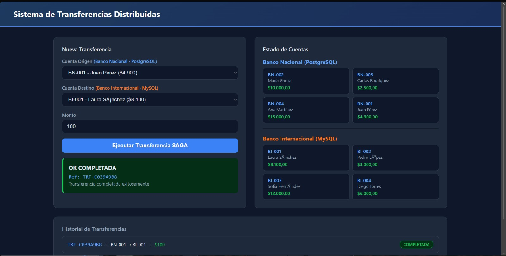
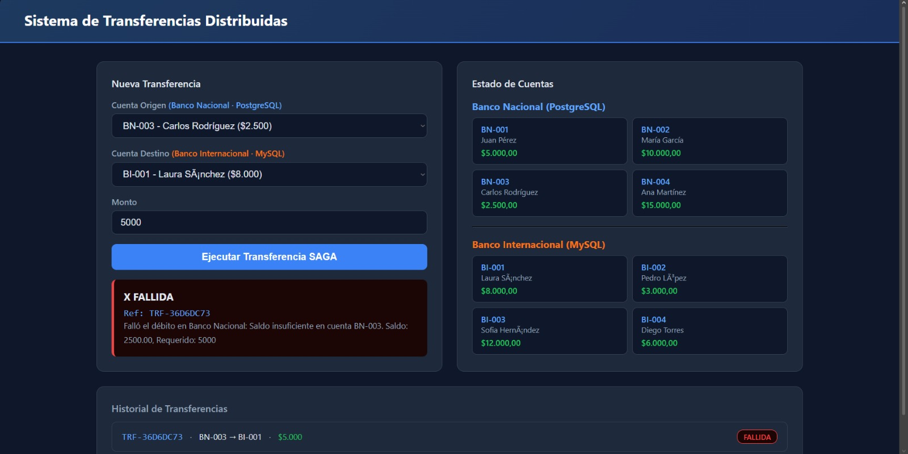
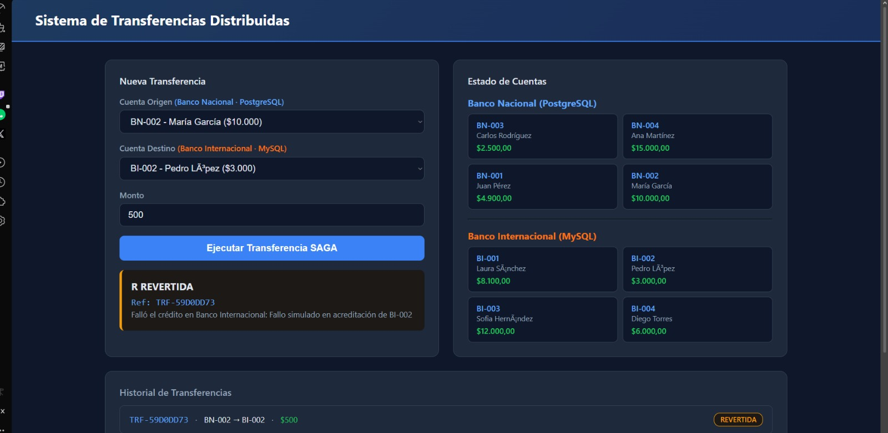

# Sistema de Transferencias Distribuidas

**Patrón SAGA Orquestado · PostgreSQL + MySQL · Spring Boot 3.2**

Arquitectura de Software (3384) · Pontificia Universidad Javeriana · 2026-10

---

## 1. Instrucciones de Instalación

### Prerrequisitos

- Docker Desktop instalado y corriendo
- Git

### Clonar el repositorio

```bash
git clone https://github.com/tu-usuario/transferencias-distribuidas.git
cd transferencias-distribuidas
```

### Estructura de archivos requerida

Verificar que los SQLs estén en la ruta correcta antes de ejecutar:

```
src/main/resources/
├── schema-nacional.sql        ← PostgreSQL
├── data-nacional.sql
├── schema-internacional.sql   ← MySQL
└── data-internacional.sql
```

### Levantar el sistema

Un solo comando levanta las dos bases de datos y la aplicación:

```bash
docker-compose up --build
```

La primera vez tarda 3-5 minutos mientras descarga las imágenes y compila Maven. Cuando aparezca:

```
Started TransferenciasApplication in X seconds
```

El sistema está listo. Abrir en el navegador: **http://localhost:8080**

### Comandos útiles

| Comando | Descripción |
|---|---|
| `docker-compose up --build` | Construir y levantar todo |
| `docker-compose down -v` | Apagar y borrar volúmenes |
| `docker-compose logs app` | Ver logs de la aplicación |
| `docker-compose ps` | Ver estado de los contenedores |
| `docker-compose restart app` | Reiniciar solo la app (cambios en HTML) |

---

## 2. Arquitectura Implementada
```
┌─────────────────────────────────────────────────────────────┐
│                    TransferenciaController                   │
│                  POST /api/transferencias                    │
└──────────────────────────┬──────────────────────────────────┘
                           │
                           ▼
┌─────────────────────────────────────────────────────────────┐
│              TransferenciaService  ⭐ ORQUESTADOR ⭐          │
│         (sin @Transactional — coordina pasos locales)        │
└────────────────┬────────────────────────┬───────────────────┘
                 │                        │
                 ▼                        ▼
┌───────────────────────┐    ┌───────────────────────────────┐
│  BancoNacionalService │    │   BancoInternacionalService    │
│  @Transactional       │    │   @Transactional               │
│  nacionalTxManager    │    │   internacionalTxManager       │
│                       │    │                                │
│  PostgreSQL 🐘        │    │   MySQL 🐬                     │
│  - debitar()          │    │   - acreditar()                │
│  - revertirDebito()   │    │                                │
└───────────────────────┘    └───────────────────────────────┘
```

### Componentes del sistema

| Componente | Tecnología | Puerto | Rol |
|---|---|---|---|
| Frontend | HTML/CSS/JS | 8080 | Interfaz de usuario |
| Backend | Spring Boot 3.2 | 8080 | API REST + Orquestador SAGA |
| Banco Nacional | PostgreSQL 15 | 5432 | Base de datos origen |
| Banco Internacional | MySQL 8 | 3306 | Base de datos destino |

### Flujo del patrón SAGA

```
┌─────────────────────────────────────────────────────────────┐
│                    SAGA ORCHESTRATOR                        │
├─────────────────────────────────────────────────────────────┤
│  PASO 0: Generar referencia UUID única                      │
│                                                             │
│  PASO 1: Debitar Banco Nacional (PostgreSQL)                │
│          └─ ÉXITO  → Estado: DEBITO_COMPLETADO              │
│          └─ FALLO  → Estado: FALLIDA (fin)                  │
│                                                             │
│  PASO 2: Acreditar Banco Internacional (MySQL)              │
│          └─ ÉXITO  → Estado: COMPLETADA                     │
│          └─ FALLO  → COMPENSAR: revertirDebito()            │
│                     → Estado: REVERTIDA                     │
└─────────────────────────────────────────────────────────────┘
```

### Flujo del SAGA por pasos

| Paso | Acción | Éxito | Fallo |
|---|---|---|---|
| 0 | Generar referencia UUID | Continuar | — |
| 1 | Debitar Banco Nacional (PostgreSQL) | DEBITO_COMPLETADO | FALLIDA |
| 2 | Acreditar Banco Internacional (MySQL) | COMPLETADA  | COMPENSAR → REVERTIDA  |

### Capas de la aplicación

```
transferencias-distribuidas/
├── config/
│   ├── BancoNacionalDataSourceConfig.java      ← DataSource, EMF, TM para PostgreSQL
│   └── BancoInternacionalDataSourceConfig.java ← DataSource, EMF, TM para MySQL
├── model/
│   ├── Cuenta.java
│   ├── Movimiento.java
│   └── EstadoTransferencia.java                ← INICIADA, DEBITO_COMPLETADO, COMPLETADA, FALLIDA, REVERTIDA
├── repository/
│   ├── nacional/                               ← Vinculados a PostgreSQL
│   └── internacional/                          ← Vinculados a MySQL
├── service/
│   ├── BancoNacionalService.java               ← debitar() + revertirDebito()
│   ├── BancoInternacionalService.java          ← acreditar()
│   └── TransferenciaService.java              ←  Orquestador SAGA
├── controller/
│   └── TransferenciaController.java            ← API REST
└── exception/
    └── GlobalExceptionHandler.java             ← Manejo centralizado de errores
```

### Endpoints disponibles

| Método | Endpoint | Descripción |
|---|---|---|
| POST | `/api/transferencias` | Ejecutar transferencia SAGA |
| GET | `/api/cuentas/nacional` | Listar cuentas PostgreSQL |
| GET | `/api/cuentas/internacional` | Listar cuentas MySQL |

---

## 3. Decisiones de Diseño Justificadas

### 3.1  Lock Pesimista en los Repositorios

**Decisión:** Usar `PESSIMISTIC_WRITE` al momento de leer cuentas para modificación.

```java
@Lock(LockModeType.PESSIMISTIC_WRITE)
@Query("SELECT c FROM Cuenta c WHERE c.numeroCuenta = :numeroCuenta")
Optional<Cuenta> findByNumeroCuentaWithLock(@Param("numeroCuenta") String numeroCuenta);
```

Esto emite en la base de datos:
```sql
SELECT * FROM cuenta WHERE numero_cuenta = ? FOR UPDATE
```

**Justificación:**

Sin este lock, dos transferencias simultáneas sobre la misma cuenta podrían leer el mismo saldo, ambas creer que hay fondos suficientes, y ambas debitar — resultando en saldo negativo (condición de carrera clásica en sistemas bancarios).

**¿Por qué Pesimista y no Optimista (`@Version`)?**

El lock optimista genera excepciones de conflicto que el cliente debe reintentar, añadiendo complejidad al orquestador. En operaciones financieras se prefiere **bloquear antes que reintentar**: el pesimista simplemente hace esperar a la segunda operación hasta que la primera termine, garantizando corrección sin lógica extra.

Ambos repositorios ofrecen dos métodos:
- `findByNumeroCuenta()` → para lecturas de solo consulta (sin lock)
- `findByNumeroCuentaWithLock()` → para operaciones que modifican saldo (con lock)

---

### 3.2 Transacción Compensatoria Explícita (`revertirDebito`)

**Decisión:** Definir explícitamente en `BancoNacionalService` cómo deshacer el débito cuando el crédito falla.

```java
@Transactional(transactionManager = "nacionalTransactionManager")
public void revertirDebito(String numeroCuenta, BigDecimal monto, String referencia) {
    // Restaura el saldo
    // Registra movimiento CREDITO con sufijo -REVERSION
    mov.setReferenciaTransferencia(referencia + "-REVERSION");
    mov.setDescripcion("COMPENSACIÓN SAGA - reversión de débito");
}
```

**Justificación:**

La reversión se registra como un movimiento de tipo `CREDITO` con sufijo `-REVERSION` en la referencia. Esto es crítico para la **trazabilidad**: el historial de la cuenta queda completo. No desaparece el débito original, sino que aparece su compensación. Cualquier auditoría puede ver que ocurrió una transferencia que fue revertida, con qué referencia y en qué momento — esencial en sistemas financieros regulados.

**Manejo del caso crítico** (compensación que también falla):

```java
catch (Exception compensacionEx) {
    estado = EstadoTransferencia.FALLIDA;
    mensajeError = "ERROR CRÍTICO: Fallo en compensación. " +
                   "Débito no revertido. Requiere intervención manual. Ref: " + referencia;
}
```

Este es un reconocimiento honesto de la limitación inherente de SAGA: si el sistema cae mientras compensa, el estado queda inconsistente. El diseño lo documenta claramente y preserva la referencia única para resolución manual, que es la respuesta correcta para un sistema de este nivel.

---

### 3.3 Máquina de Estados Explícita (`EstadoTransferencia`)

**Decisión:** Modelar el progreso del SAGA con un enum de estados granulares.

```java
public enum EstadoTransferencia {
    INICIADA,           // El orquestador arrancó
    DEBITO_COMPLETADO,  // Paso 1 exitoso
    CREDITO_COMPLETADO, // Paso 2 exitoso
    COMPLETADA,         // SAGA cerrado administrativamente
    FALLIDA,            // Error sin compensación posible
    REVERTIDA           // Compensación ejecutada exitosamente
}
```

**Justificación:**

Cada transición corresponde exactamente a un paso del SAGA. Esto cumple varias funciones:

- Permite observar en qué punto exacto falló una transferencia
- Sirve de documentación viva del flujo
- Facilita la implementación futura de un sistema de retry que sepa desde dónde reanudar una saga interrumpida
- El estado `CREDITO_COMPLETADO` señala que ambos pasos financieros terminaron antes del cierre administrativo del orquestador

---

### 3.4 Modelo `Movimiento` con Audit Trail Completo

**Decisión:** Guardar `saldoAnterior`, `saldoNuevo` y `referenciaTransferencia` en cada movimiento.

```java
private BigDecimal saldoAnterior;   // Saldo antes de la operación
private BigDecimal saldoNuevo;      // Saldo después de la operación
private String referenciaTransferencia; // Referencia compartida entre débito y crédito
```

**Justificación:**

Guardar los saldos antes y después permite:

1. **Reconstruir el historial** completo de una cuenta sin recalcular desde el inicio
2. **Detectar inconsistencias** si se producen entre las dos bases de datos
3. **Cruzar registros**: la `referenciaTransferencia` compartida entre el movimiento en PostgreSQL y el de MySQL permite verificar que una saga concreta se completó correctamente en ambos lados

---

### 3.5 Manejo de excepciones

El orquestador (`TransferenciaService`) nunca propaga excepciones al controller — las captura internamente y las convierte en el campo `estado` de la respuesta. Esto permite que el endpoint siempre devuelva HTTP 200 con el resultado en el body, simplificando el manejo en el frontend.

Las excepciones de otros endpoints (cuenta no encontrada, validaciones) son manejadas por el `GlobalExceptionHandler` con `@RestControllerAdvice`.

---

## 4. Capturas de Pantalla de Pruebas

### Caso 1: Transferencia Exitosa 

**Datos:** Origen BN-001 → Destino BI-001, Monto $100

**Resultado esperado:**
- Saldo BN-001: disminuye $100
- Saldo BI-001: aumenta $100
- Estado: `COMPLETADA`

>  

---

### Caso 2: Saldo Insuficiente 

**Datos:** Origen BN-003 (saldo $2,500) → Destino BI-001, Monto $5,000

**Resultado esperado:**
- Falla en Paso 1 (débito) por saldo insuficiente
- Ninguna base de datos es modificada
- Estado: `FALLIDA`

> 

---

### Caso 3: Compensación SAGA 

**Datos:** Origen BN-002 → Destino BI-002, Monto $500 (fallo simulado en MySQL)

**Resultado esperado:**
- Paso 1 exitoso: débito completado en PostgreSQL
- Paso 2 falla: error en acreditación MySQL
- Compensación ejecutada: `revertirDebito()` restaura el saldo
- Estado: `REVERTIDA`

>  

---

## 5. Reflexión

Este taller permitió comprender en la práctica uno de los problemas más complejos de los sistemas distribuidos: mantener la consistencia de datos entre múltiples bases de datos heterogéneas. En nuestro caso trabajamos con una Saga orquestada, por lo que sí existe un coordinador central que controla el flujo de la transacción, pero sin recurrir a un mecanismo de bloqueo global como en 2PC. Esto nos permitió entender cómo se puede coordinar una operación distribuida manteniendo control y trazabilidad sin sacrificar completamente la escalabilidad.

Durante el desarrollo también pudimos reaplicar conceptos vistos anteriormente y regresar a Spring Boot, reforzando cómo se construye una API y cómo se integran distintos servicios en una arquitectura distribuida. Más allá de lo técnico, resultó interesante comprender que la consistencia no tiene que ser inmediata. Aunque inicialmente esto parecía una debilidad, al analizarlo mejor vimos que ofrece trade-offs importantes, como mayor velocidad y mejor rendimiento bajo carga.

Al principio el patrón no parecía tan escalable, pero al implementarlo entendimos que el escalado horizontal es relativamente sencillo, ya que cada servicio maneja transacciones locales y puede replicarse de manera independiente. Finalmente, el uso de locks pesimistas nos mostró claramente el trade-off entre seguridad y rendimiento: en escenarios de alta concurrencia pueden convertirse en un cuello de botella. En producción, estrategias como el particionamiento por cuenta o colas serializadas permitirían reducir la contención sin comprometer la integridad.

---

